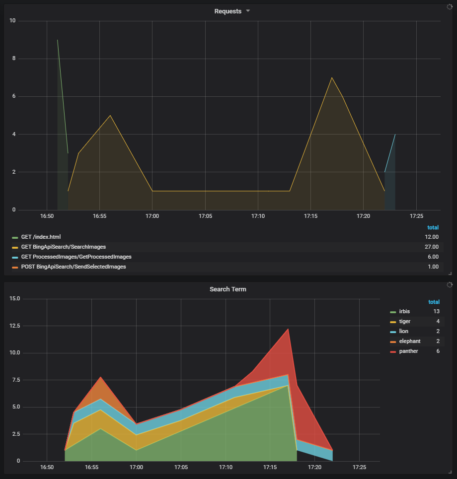

# CURSO AZURE HACK2PROGRESS

## 1. Configuración del Entorno

Para poder realizar las prácticas del curso necesitas:

- Una cuenta de Azure con al menos 5€ de crédito. En caso de no disponer de cuenta, se puede crear una gratuita aquí: <https://azure.microsoft.com/es-es/free> Para crearla es necesario:

  - Una cuenta de Microsoft, que se puede crear directamente durante el proceso.
  - Una tarjeta de crédito.

- Una cuenta de Azure Cognitive Services con acceso a Bing Search: <https://docs.microsoft.com/en-us/azure/cognitive-services/cognitive-services-apis-create-account>

- Instalar .Net Core 2.1: <https://www.microsoft.com/net/download>

- Instalar VS Code: <https://code.visualstudio.com>

- Instalar Node.js y npm: <https://nodejs.org/en/download>

- Instalar las siguientes extensiones de VS Code (Ctrl+Sifht+X):

  - C#: <https://marketplace.visualstudio.com/items?itemName=ms-vscode.csharp>
  - Azure Functions: <https://marketplace.visualstudio.com/items?itemName=ms-azuretools.vscode-azurefunctions>
  - Azure App Service: <https://marketplace.visualstudio.com/items?itemName=ms-azuretools.vscode-azureappservice>
  - Azure Storage: <https://marketplace.visualstudio.com/items?itemName=ms-azuretools.vscode-azurestorage>

- Instalar las tools de Azure Functions: `npm install -g azure-functions-core-tools`

- Instalar Git (opcional pero muy recomendable si quieres ver las soluciones): <https://git-scm.com/downloads>

- Si necesitas ver la solución de alguno de los temas puedes hacer lo siguiente:
  - Nos situamos en un directorio donde queramos obtener la solución.
  - Ejecutamos `git clone -n https://github.com/jordidiaz/Hack2Progress.git`
  - Para obtener la solución a un tema: `git checkout solucion_tema_X` donde X es el número de tema.

- Si necesitas dar acceso a los recursos de Azure a algún miembro de tu equipo:
  - Desde el portal de Azure accede al Resource Group o al recurso al que quieres dar acceso.
  - En la pestaña Access control (IAM) añade a los miembros del equipo con el rol deseado.
  - Si son varios miembros puede ser interesante crear un grupo en Azure Active Directory y asignar los permisos al grupo.

## 2. Construcción y Despliegue en Azure de una Aplicación Web

- Nos situamos en un directorio de nuestro disco donde vamos a tener el código de la formación, por ejemplo C:\Workshops\AzureDemo.

- Abrimos una consola en ese directorio.

- Ejecutamos `dotnet new` para ver las plantillas disponibles. Utilizaremos la de Angular.

- Ejecutamos `dotnet new angular -o webapp`. Es importante que se llame así para que sea mas facil aprovechar el código de solución que os ofrecemos.

- Abrimos VSCode y desde `File-Open Folder` abrimos el directorio raíz del código (AzureDemo). Exploramos la aplicación que acabamos de crear.

- Abrimos una terminal en VSCode con `Ctrl+ñ` y accedemos al directorio de la aplicación (`cd webapp`). Ejecutamos `dotnet restore` para instalar las dependencias del servidor. Cuando acabe accedemos al directorio **ClientApp** y ejecutamos `npm install` para instalar las dependencias del cliente.

- Abrimos el fichero `Startup.cs` vamos a la línea 65:
  `spa.UseAngularCliServer(npmScript: "start");` esta línea hará que cada vez reiniciemos el servidor con un `dotnet run` se reinicie el cliente.

- La cambiamos por:
  `spa.UseProxyToSpaDevelopmentServer("http://localhost:4200");` y así redirigiremos las peticiones del cliente al puerto 4200.

- Deshabilitamos **HTTPS** (por simplicidad)

  - En el fichero startup.cs:
    - Borrar `app.UseHsts();` en la línea 42.
    - Borrar `app.UseHttpsRedirection()` en la línea 45.
  - En el fichero Properties\launchSettings.json:
    - Borrar `https://localhost:5001;` de la línea 21.

- Ejecutamos la aplicación y la probamos:
  - Accedemos a la carpeta **ClientApp** y ejecutamos `npm start`
  - Desde la vista de Debugger de VSCode iniciamos el servidor.

### Añadir Cognitive Services a la búsqueda

- Creamos un GUID desde <https://www.guidgenerator.com/online-guid-generator.aspx>

- Añadimos `<UserSecretsId>GUID_generado</UserSecretsId>` al **PropertyGroup** del fichero .csproj.

- Creamos un secreto de usuario localmente para almacenar la Api Key de Bing Search (ejecutar en el directorio del .csproj):
  `dotnet user-secrets set "Azure:BingSearchApiKey" "<clave obtenida en Manage Keys en el Portal de Azure>"`

- Añadimos el paquete Nuget del SDK de buscar imágenes:
  `dotnet add package Microsoft.Azure.CognitiveServices.Search.ImageSearch`

- Vamos a enviar el **Summary** del tiempo a la busqueda de imagenes de [Bing](https://www.bing.com/). Así obtendremos una imagen relacionada con la información del tiempo.

- Abrimos el fichero `Startup.cs`:
  - Añadimos `public static string BingSearchApiKey { get; private set; }` justo al inicio del cuerpo de la clase.
  - Añadimos `BingSearchApiKey = Configuration["Azure:BingSearchApiKey"];` al final del constructor (método Startup).

- Abrimos el fichero `SampleDataController.cs`:
  - Añadir `public string ImageUrl { get; set; }` a la clase **WeatherForecast**.
  - Añadimos el siguiente método a la clase SampleDataController:
    ```csharp
    private static IList<ImageObject> SearchImagesWithSdk(string searchTerm)
    {
      var subscriptionKey = Startup.BingSearchApiKey;
      var client = new ImageSearchAPI(new ApiKeyServiceClientCredentials(subscriptionKey));
      var imageResults = client.Images.SearchAsync(query: searchTerm).Result;
      return imageResults.Value;
    }
    ```
  - Sustituimos el método **WeatherForecasts** por este otro:

    ```csharp
    public ActionResult<IEnumerable<WeatherForecast>> WeatherForecasts()
    {
      if (Startup.BingSearchApiKey == null)
      {
        return StatusCode(StatusCodes.Status500InternalServerError, "Registra la key Azure:BingSearchApiKey");
      }

      var rng = new Random();
      return Ok(Enumerable.Range(1, 5).Select(index =>
      {
        var summary = Summaries[rng.Next(Summaries.Length)];
        var searchTerm = $"weather {summary}";

        return new WeatherForecast
        {
            DateFormatted = DateTime.Now.AddDays(index).ToString("d"),
            TemperatureC = rng.Next(-20, 55),
            Summary = summary,
            ImageUrl = SampleDataController.SearchImagesWithSdk(searchTerm)[index].ThumbnailUrl
        };
      }));
    }
    ```

  - Añadimos los usings recomendados por VS Code.

- En la aplicación cliente abrimos el fichero `fetch-data.component.ts` y añadimos `imageUrl: string;` a la interfaz **WeatherForecast**.
- En la aplicación cliente abrimos el fichero `fetch-data.component.html` y sustituimos al final del loop **ngFor** el último <td> por lo siguiente:
  ```html
  <td>{{ forecast.summary }}
    <br>
    
  </td>
  ```
- Exploramos el código añadido y ver su funcionamiento.

### Desplegar Web App en Azure

- Partiendo del grupo de recursos creado para el servicio de Cognitive Services:

- Creamos una Web App usando el grupo de recursos ya existente y con sistema operativo Windows
- Dentro de un nuevo Service Plan gratuito.
- Activando Application Insights.

- Desplegamos la aplicación en la Web App:

  - Ejecutamos en la terminal: `dotnet publish -c Release`
  - Desde la pestaña de Azure seleccionamos la WebApp y le damos a desplegar:
    - Seleccionar la WebApp creada en Azure.
    - Seleccionar el contenido del directorio publish.
    - Añadir la Azure:BingSearchApiKey a las AppSettings de la Web App desplegada.

## 3. Uso de Azure Storage

- Creamos una Storage Account dentro de nuestro Resource Group, general purpose V2, LRS y Hot Tier.

- Creamos un secreto de usuario localmente para almacenar la Connection String de la Azure Storage Account (ejecutar en el directorio del .csproj):
  `dotnet user-secrets set "Azure:StorageConnectionString" "<cadena de conexión obtenida en Access Keys en el Portal de Azure>"`

- Añadimos el paquete Nuget de la Azure Storage Client Library:
  `dotnet add package WindowsAzure.Storage`

- Creamos una carpeta dentro de webapp que se llame `Storage`

- Creamos dentro un fichero que se llame `AzureStorageBlobClient.cs` y copiamos el siguiente código:

  ```csharp
  using Microsoft.WindowsAzure.Storage;
  using Microsoft.WindowsAzure.Storage.Blob;
  using Microsoft.WindowsAzure.Storage.RetryPolicies;
  using System;
  using System.Collections.Generic;
  using System.Linq;
  using System.Threading.Tasks;

  namespace webapp.Storage
  {
    public class AzureStorageBlobClient
    {
      private CloudBlobClient _blobClient;

      public AzureStorageBlobClient(string storageConnectionString)
      {
        var storageAccount = CloudStorageAccount.Parse(storageConnectionString);
        _blobClient = storageAccount.CreateCloudBlobClient();
      }

      public async Task AddFileAsync(string containerName, string fileName, byte[] buffer)
      {
        CloudBlobContainer container = _blobClient.GetContainerReference(containerName);
        await container.CreateIfNotExistsAsync();
        CloudBlockBlob blobRef = container.GetBlockBlobReference(fileName);

        var blobRequestOptions = new BlobRequestOptions()
        {
            RetryPolicy = new ExponentialRetry(TimeSpan.FromSeconds(1), 5)
        };

        await blobRef.UploadFromByteArrayAsync(buffer, 0, buffer.Length, null, blobRequestOptions, null);
      }
    }
  }
  ```

- Abrimos el fichero `Startup.cs`:
  - Añadir `public static string StorageConnectionString { get; private set; }` junto a la propiedad BingSearchApiKey.
  - Añadir `StorageConnectionString = Configuration["Azure:StorageConnectionString"];` al final del constructor (método Startup).

- En la carpeta **Controllers** creamos el siguiente fichero `BingApiSearchController.cs` con el siguiente contenido:
  ```csharp
  using System;
  using System.Collections.Generic;
  using System.IO;
  using System.Linq;
  using System.Net;
  using System.Net.Http;
  using System.Threading.Tasks;
  using webapp.Storage;
  using Microsoft.AspNetCore.Mvc;
  using Microsoft.Azure.CognitiveServices.Search.ImageSearch;
  using Microsoft.Azure.CognitiveServices.Search.ImageSearch.Models;
  using Microsoft.AspNetCore.Http;

  namespace webapp.Controllers
  {
    [Route("api/[controller]")]
    public class BingApiSearchController : Controller
    {
      [HttpGet("[action]")]
      public ActionResult<IEnumerable<string>> SearchImages(string searchTerm)
      {
        if (Startup.BingSearchApiKey == null)
        {
          return StatusCode(StatusCodes.Status500InternalServerError, "Registra la key Azure:BingSearchApiKey");
        }

        var images = BingApiSearchController.SearchImagesWithSdk(searchTerm);
        var urls = images.Select(img => img.ThumbnailUrl).ToList();

        return Ok(urls);
      }

      [HttpPost("[action]")]
      public async Task<IActionResult> SendSelectedImages([FromBody] string[] selectedImages)
      {
        if (Startup.StorageConnectionString == null)
        {
          return StatusCode(StatusCodes.Status500InternalServerError, "Registra la key Azure:StorageConnectionString");
        }

        var httpClient = new HttpClient();
        var storage = new AzureStorageBlobClient(Startup.StorageConnectionString);
        var originalImagesContainerName = "original-images";

        foreach (var selectedImage in selectedImages)
        {
          var fileName = $"{Guid.NewGuid()}.jpg";

          var downloadedImage = await httpClient.GetByteArrayAsync(selectedImage);
          await storage.AddFileAsync(originalImagesContainerName, fileName, downloadedImage);
        }

        return Ok();
      }

      private static IList<ImageObject> SearchImagesWithSdk(string searchTerm)
      {
        var subscriptionKey = Startup.BingSearchApiKey;
        var client = new ImageSearchAPI(new ApiKeyServiceClientCredentials(subscriptionKey));
        var imageResults = client.Images.SearchAsync(query: searchTerm).Result;
        return imageResults.Value;
      }
    }
  }
  ```
- Con esto ya tenemos lista la parte del servidor, ahora vamos a implementar la parte del cliente. Para ello nos situamos en la terminal en la carpeta ClientApp (`cd ClientApp`) y ejecutamos el siguiente comando de la CLI de Angular:
  - `npm run ng generate component image-search`
  - Revisamos los ficheros del componente generado.

- Abrimos el fichero app.module.ts y añadimos una nueva ruta después de la línea 30: `{ path: 'image-search', component: ImageSearchComponent }` (no olvides poner una coma al final de la línea 30).

- Añadimos una nueva opción de menú en el fichero nav-menu\nav-menu.component.html. Después de la línea 29 insertamos lo siguiente:
  ```html
  <li [routerLinkActive]='["link-active"]'>
    <a [routerLink]='["/image-search"]' (click)='collapse()'>
      <span class='glyphicon glyphicon-picture'></span> Image search
    </a>
  </li>
  ```

- Ya podemos ejecutar la aplicación para comprobar que hemos creado correctamente el nuevo componente antes de modificarlo.

- Borramos el fichero image-search.component.spec.ts que es para tests y no lo vamos a utilizar.

- Sustituimos el fichero image-search.component.html (la plantilla) por lo siguiente:
  ```html
  <div id="logo">
  <!-- logo block including search market/language -->
  <img src="data:image/png;base64,iVBORw0KGgoAAAANSUhEUgAAAHgAAAAyCAIAAAAYxYiPAAAAA3NCSVQICAjb4U/gAAARMElEQVR42u2bCVRUV5rHi8VxaeNuOumYTs706aTTZrp7TqbTk5g+9kn3OZN0pjudpZM5SfdJzEzPyZmO1gbIJhmNmijy6hUFsisCgsqigoCt7IoKgoDgUgXILntR+/aWzHfvfQUFFEURsU8cKe/hFFL16r3f++53/9//uyXSWUwjZgPDshzHcy4PnuMXHvP4EJ1qufpPyRHby3Iv93XqbDY7y7IC9QU48wr6RMtVEb1NpJAvoeQvpVF7L5c0jQ6ZHAwJcH6B+HyBzm6pEymkIlomouUiWiqiJCvpwDdOxCdfr+nV6x0Mwy+gnqeIJqAxa3iikJDhEyX5fmx4eZcGJ+yFxz2DPg6pQwA9eQBuSnJC3bCQPe4/6ChxjqbxAVQgnHM8OKBzW5s4lucfsOSxAHoWPh4eggRy/ubprQzL6a1Wo83KfZuWl5lBU39v0CDeQcDbGQa0PB7jT4RfHawDJD562bTzERiznI1l4xurX0yNfCVdcUbTAtAXQE+PSnbEYgkoyfmkOGNL8dEtxZkwPhFGFjz/tCR7b+35su5WrcXCuq1gOa5ZO7Q6eruIBuEk/WH8zj6LaQH0dNB8t8X03dgIqJ6cQyainENBhmSJQvxi2v4j12tMqIydFN3wy8XuO0sOSNEVUZI1ypA23cgCaDegewTQAlYfGNTEQCWVQkrO1l8h+eu5E2M2m+u5AfRBq+Xf0unFlHSxUv5BQZqRcSyAdg/60dgd+NPFf8hPiaotPQCjpnR/bWnExcI/5h96KmmXHyqsUGbwo+S7Lp2zu0Y0immuR6/NbLqSc7NhxGb59qyGXoMm6/59Bt0rgEYcY+svsOz4IscxHJhdXK/REFRZsISENiX9fkx4q0E3nqnRKxFrbIux5I3fnhL8Rp038o77u2iluxbjo7Fh+HwkqmvVnBt1wVoZ9rPibB8KQCPc6Tfr3cmQb6HX4QH0gW0ENATIHe2gwW5lp4rb+wZaKVE2uAWNgraqp2OJkqRsyb7qc+OgJ+tuMhG5mWS6kGsEhc4730TeJ/zXN1X9bh4zg4bhAlpSfPS149Gqa1U3RgeMdlCraCqji55f0GZIHeEkoqMbqqdXd/j3r2/ptd+JDhQpUbLec6GYnQyaQY46KlsQLpfcgZx2koI4IScRSQ6vtzIM1DhjVovJbnOgtCOkHo+qH+t+JPAdAERvMessZrPdzuBqYNLxcQ3lFWh4Y2mnelmU2EcpWR8T+ubJ5JTmq61jWjPjmF683V/QuLRuHBlcCuKPkvlFSVKba3ERw5HbAJjKutU5rU25msbmgT7X0zE5HPmtzdmaxhx1Y59eR25Jl24sqeHynwozXj2m2pRJv5EXF1p++lJfp4VhZpy1+H/hzzqrtayrNbQ8/628xFcyqV8di34vL2XfxfMtw/1WtEywl3o7cjXXc2431fZ2zgI6D0CjIzN6u+Pl1AOiaCJRpb5Rkqfid/65MCNPfb3PqIeIwPGN/t1X0CwSFmx6S70f0nmyNcqgOu0AClyeJbcB5N4v0ykQLT6UJLAkx/XG95j0j0YH+dAS36itJ243WR3M0VsNG5N2+0fB2itGKzC6amQRr1WGhFadGXWmymmzioPbWdvf87vchOWwTlBEO4iJePc/INkQu2NfXaXWbn8//7A/RGfU1vdPHvYiR+NrA4TK2gofdE5SYVDoUpdQsueS9nx2LqeoUz1oNjkmUp3zHOcS4wh0TBj6aFos5Ghn4hyXH0MW8+ajKpESncCHpw+bWXbcQoKX2Xl+UzqNL14mKz3leqf6TMY1qmBku1PSDE1LXGP1CmUgfNBSZdDag2HrEnYsVwX7oO4HYu2nkMkr8i244J/EGOeBgjs3fwDqCODSYh+FZDEtWx0Xsi4+fFVsqD/S+6DiAyKqz76ZfwSzEr99MsV71cG3G8Y2KENmeLH0HxTyfzkSGVZRcLm/e8RqsXNCIuTnEuMToBXi6GsX4RAkF+I0x9gYpkOv/a+io35Yb/woYdeN0UHXOTQBGleV8tLTrrf5rsm4WhUqUqKc82llwbrokOWqoP84lZrb2nxTO3xbO1za2fY/f8tZARU8hVg/ogqq7G3nJh0f3erL/T1PxGMNSotXKuXv5iZmqa9dG+7XjI1cHehVNFx4IfUrP1oMq8iTyXuQNIoSv33q0BxA2zn+o4K08RbMVNHtHMupgM2Z0V9eKasbHtDjxUGIbS8y+ARoShJaWdQ42Nc4dBdGzWBPQduNiPL8jSl7ICf4KmQ/Obyvqq+DZSZNbSdoBS4spVNA942DVsgXK4NXKrar6qvN0KzDEUFuJ8wPmPX+6D6hc9hSmM4IRxDEyIjd/uusGHL5cCdgWpggm7NkEWZYIvbNxo+L0v1pMu9hAs0FNClwSzo0i5D/MA309GKHkq5WhbyRHR/TVN0yNmxxMDy+HC9ydBj5dF80S2TwcfDTn4ZyHB0TjrwiNuSvZSdbdVrWqTRcNYmD419GoNFpTAVtNq6OCcUdO7kvJf+8stjuTj6OOeybM5RI0lDSpxMjhm2WcdAwwY6pGxZRuC6NkkEj2za9IsJhNWKzvpYdR+63iNqGQHtfggMmncPxC7TUSGZcP52ZxCWVi9fHhqU11xA95Lky7DOb1seEjTfShA8i6wEl9DOXx4a8mBUdWJHfMNhnZ1mSOcePgEFTbkFDoK2CiEaBIn8maQ/86o4SylWx1y6SD11Gy5tGB3mnoALP8LUTsZAxRIptL6Tu19ps7pZKYm+xF+92LaUDviFohuWpq5U+ZIWlvRwSiI4vLhWxszU9poB+LH7Hjw/t2XgYjR8f3vtM8u7vxUcsiw7wxdB9FNLvxobtq6swOBysU4WR/PaSZ9BoMZT/pSTP4b6DgIRNZW+XPw5GX4WkrLtdKGdYWKX064gHS23df7V0XFa6uRaWNzGO51O/whEzR9A8TmQdxrEnY7ejrSA0SdbSWaDDcWjJ/yLQnLeg8WIYWVeutVl1eIzZrANm4y3tUEFry2fnsx9H6QVlEsgquy+ft7HjAofzDrQs4doV99INS0W1VrtcQZZEcWH7bcFA4fjiDo0/jvQlCnnt3V52ZluCw5XRv+cl4fOcK2j8gGSf39b825yDsBQIU5uaLY3Q4p3VxcxsK6EAOpbIO/A6LroDwQPWqr7O51O/JLllrTK4bqCHuEcYNOdNRB+7dV2out3V1R163Qoa6yuFrABA4xBBKaX+IhYbEjjJuxYT5wk0AvUuknffFDS+V5yesZ9tu/H2ycQ1McHI3yEbQmYGHVF1ZlYjzQk6nLxRVe8WNC6KGK6oS71MEUCytuR8HsPNDfTx280zgQamnQb9CkWwK2icotmIC8UkCDYk7hxjHZzniL5H0K4PC+Oo6Gr94HTq2pgInCJmUC9KcXhlgbegY8KRCqYDYuovcDP7OeDo/zyDxp0X6c9TI01kVfQKNMJ3XO0eNEnTnQbDSnegA8vz8TQSb0jepWMZT6BR9ci/A3zvETQp1Yjz22XQv1+UOWMCwWUeFDLzChrCif0APhQJXulTcRGDWITdb9AhVWeItH0iaaeWZXjeU0QD6LfuHTTyHBge1qjsWw3/mha1iPKoOmhxSPnpeQXNQzj9qTiLOAxPqXYMWO87aIiqqKsVeOLKVsUEt5uNgsU1Q0ffxrC/PBbrBWgXP5qfcG+FB1TD0AZ9Oy8FSUWicGlPqWOOoJHXPA56igNOfoC7tjlLRZTP88l7DbAZc55BT10MQUWcarvpRxHnSFrUcduDJQ9/6TEbNhyMQAeJ2uaxMnSxSZ06mif7LpqH+z89l7UGFKU3ahqBlgaVnfamrzRRGSpnAo1+wA7XCwPdyJTAH/FBcRrjtEkB9MsZHitD5Wygeb4LQE9RHfzX8KPVMLaWXDUl/c/CLDszY2cH/pDUUoM9OPlsJTgBrUGgBeeM5bqNui8vnXs64XNn8pXMUqqgiYPCM6jkFHo/z3kFGt0bDHpyyJBzgHHHoP01hDPKMNKlUcDiBjfvoKdEND46dNF+n5uAPVXpquiQ8p521nUL+cSM59v12o2p+5CjNLvXgWTQVrDPOfZriEWt1XL0Vv2LR/b5Ib5yvJ96tljGCzRYFhtT9ua1thAnzlvQtCy6rhJtVuIY55Ylxuiwdxp02eqGTWlf+eJ7DObyWydTDA77PIM2ugON5/Sp9pYlZH8zJXvh8L5rQ30OVqhMBeXJsBrd2FvHE8Fi9AcbFoXaLKaSFIFWN5oZpry37XcnExfjHh02ZWQzTgLFRCz7UrLH4nbIq/LbdKN2jmO96O66gJb+4ij1cdHRj2AUZ3xUnP7novQ38hKhFl+KDg5fUQAjWPxyepR6bBRH+f2PaDyloE3zyek03yjIvChUn0v8gq6/0KIdvGs29JkMLaODKc01L6RGwrX/85EDm7LjiaZ496Rn904h/qquYuvfclepQmYvtSdAo5TySHTQR6fTa/u6ie8zt+bsLHYVampAWP0hL1E9OuzK6n6DJqkBZtWrmSpftB8KprXMlw54ND7i+SORG9P3PRYf7od9tGcTdp/rvfMucZUp6R9PEtXh1vbE9d4jkPsPiEVkzwo9exSjDgAdAAk0v+2G2e4g/S3vd9v2mQ2Px4SCI+qDD+XjHOQ5Mk6VAWsPhv8qMzq5uWYU9ouyk5YjojpeSaewZy0JmKY61qlCUCuLkp5QX/cAGlTHWjoEKl5olxS033IBzZNivF2n/fhMBvjAvmT/FOrUkG09kqXKwM2ZdHVfh53l3hHse+l70MqaEbT3w+mI+lGynxzaf7DxEtkiNNd9IPB6vc2WUFd1oKZkP4xa9DPS+RyexNRXZd5qqOnvhq6z20YwKXyzmmr3X4HXl5Z0ql1fAuZUXF0FHCfySol6eNCDJaS1WmPqKiOvnFddKVOPDLJT9DJ+IzSmS+/cEp89vintwLOHdj+TvOtnafuhSE5vrh1CBixr4djf5qaIsFP6l+Jj9wxaIYT/92I/D68s6tCNMUQZzL0jzjlVhXMXAEeesWjvAM8KXQy84szcnhb+LpwEy03Z1yE0xkgPwlNdR97KsRN7B9z5c1D+cTqHrc+k7zca4PbYUO9b2PxiYB0/OxxJhEPEpXOQo6/OxVyell4o2UrV9g8L0+sGerGuXPi6i3AfNHrtatQLloKaPt7aJDoOoF0y7BzsfFq6TBH0m2Oxhe03jQ7H+D65/9/4xrv8vIfZgIP9YGM14bmG3t6uHREVaZqXxwSTnpPXGRl148EzS2+uG7ZZ2YcmiklqwptXZmzLkZ1KHTrtT1P2koj8fU4SLIwivcN+XNO0KUu5SCFzU+y5qjqcx2Hp/8eEXbsvl/QYdQ6U7tiHCDTLDZlMpe23YdFmOX6y/SJ42WArdul17+cl+0RB4Mq/QwcWYt0iIq32IbNJ1XjhuSN7facsjIg+3nmPt9KuPxj+2fnc5qF+Zr533T0gEc226rVPqkJfP6E61HwFPJ8xixn2ITqQrGShcG0b02bcqAMd4ov31oCm3lKUacaGl8hpY7CQZVv1o6GVZzbERfhMtLFxHUhJQR7CFKjoarM6l9WHEjRa4lZEQ+Rt81OIn0gIe/WY8r0zR7aczfywMO313LgfHvpiGSKG2uR+tOSdnCQQJKSQEE3xnEA5XBvs/e+zWetiQnD5KFlES186sj/9Rp0ef6HsYf4WLVx9p1H304TP/Wix8+vcrpWEICggnB+PCwsuPz1oMo7zEk1N9nhYHI6yLs2bOXHPJu0E8Q/77HGGYR/yL+DjvgkLGUNRV/F6TsIzh75cHxe+IjpouTJwOR24Mib46cRdsPkm/ELR1f5uG+l1OS0ekYeDQinVOTbqmP9t0A98XEM2MDNsr17X0N9T1aWBErSkSwNlt2Z0SG+DpOCm8fJ/b7k8gBQkHh4AAAAASUVORK5CYII=">
  <I>api</I>
  <p><select name="where">
          <option value="es-AR">Argentina (Spanish)</option>
          <option value="en-AU">Australia (English)</option>
          <option value="de-AT">Austria (German)</option>
          <option value="nl-BE">Belgium (Dutch)</option>
          <option value="fr-BE">Belgium (French)</option>
          <option value="pt-BR">Brazil (Portuguese)</option>
          <option value="en-CA">Canada (English)</option>
          <option value="fr-CA">Canada (French)</option>
          <option value="es-CL">Chile (Spanish)</option>
          <option value="da-DK">Denmark (Danish)</option>
          <option value="fi-FI">Finland (Finnish)</option>
          <option value="fr-FR">France (French)</option>
          <option value="de-DE">Germany (German)</option>
          <option value="zh-HK">Hong Kong (Traditional Chinese)</option>
          <option value="en-IN">India (English)</option>
          <option value="en-ID">Indonesia (English)</option>
          <option value="it-IT">Italy (Italian)</option>
          <option value="ja-JP">Japan (Japanese)</option>
          <option value="ko-KR">Korea (Korean)</option>
          <option value="en-MY">Malaysia (English)</option>
          <option value="es-MX">Mexico (Spanish)</option>
          <option value="nl-NL">Netherlands (Dutch)</option>
          <option value="en-NZ">New Zealand (English)</option>
          <option value="no-NO">Norway (Norwegian)</option>
          <option value="zh-CN">People's Republic of China (Chinese)</option>
          <option value="pl-PL">Poland (Polish)</option>
          <option value="pt-PT">Portugal (Portuguese)</option>
          <option value="en-PH">Philippines (English)</option>
          <option value="ru-RU">Russia (Russian)</option>
          <option value="ar-SA">Saudi Arabia (Arabic)</option>
          <option value="en-ZA">South Africa (English)</option>
          <option value="es-ES" selected>Spain (Spanish)</option>
          <option value="sv-SE">Sweden (Swedish)</option>
          <option value="fr-CH">Switzerland (French)</option>
          <option value="de-CH">Switzerland (German)</option>
          <option value="zh-TW">Taiwan (Traditional Chinese)</option>
          <option value="tr-TR">Turkey (Turkish)</option>
          <option value="en-GB">United Kingdom (English)</option>
          <option value="en-US">United States (English)</option>
          <option value="es-US">United States (Spanish)</option>
      </select>
      <p>from Microsoft Cognitive Services
  </div>

  <div id="query">
  <!-- query controls including search field and options -->
  <h2>Bing Image Search API demo</h2>

  <input type="text" name="query" id="term" placeholder="Search for images" autocomplete="off" [(ngModel)]="searchTerm"
      (keyup.enter)="onKeyEnter()">
  <button id="search-button" (click)="onClickSearchButton()"> Search </button>

  <div class="options">
      Aspect &nbsp;&nbsp;
      <input type=radio name="aspect" id="any" value="all" checked>
      <label for="any">Any</label>
      <input type=radio name="aspect" id="square" value="square">
      <label for="square">Square</label>
      <input type=radio name="aspect" id="wide" value="wide">
      <label for="wide">Wide</label>
      <input type=radio name="aspect" id="tall" value="tall">
      <label for="tall">Tall</label>
  </div>

  <div class="options">
      Color &nbsp;&nbsp;&nbsp;&nbsp;
      <select name="color">
          <option value="" selected>Any</option>
          <option value="coloronly">Only Color</option>
          <option value="monochrome">Black and White</option>
          <option value="black">Black</option>
          <option value="blue">Blue</option>
          <option value="black">Brown</option>
          <option value="gray">Gray</option>
          <option value="green">Green</option>
          <option value="orange">Orange</option>
          <option value="pink">Pink</option>
          <option value="purple">Purple</option>
          <option value="red">Red</option>
          <option value="teal">Teal</option>
          <option value="white">White</option>
          <option value="yellow">Yellow</option>
      </select>

      &nbsp;&nbsp;&nbsp;From &nbsp;&nbsp;
      <select name="when">
          <option value="" selected>All time</option>
          <option value="month">Past month</option>
          <option value="week">Past week</option>
          <option value="day">Last 24 hours</option>
      </select>

      &nbsp;&nbsp;&nbsp;<input type=checkbox id="safe" name="safe" value="on" checked><label for="safe">SafeSearch</label>
  </div>

  <!-- these hidden fields control paging -->
  <input type=hidden name="count" value="25">
  <input type=hidden name="offset" value="0">
  <input type=hidden name="nextoffset" value="">
  <input type=hidden name="stack" value="[]">
  </div>


  <div class="float-left">
  <div class="flex-container">
      <h3 *ngIf="images">Results</h3>
      <button id="send-button" (click)="onClickSendButton()" *ngIf="selectedImages.length > 0"> Send </button>
  </div>
  <h5 *ngIf="images">({{ selectedImages.length }} selected images of {{ images.length }})</h5>

  <div class="flex-container">
      
  </div>
  </div>
  ```

- Sustituimos el contenido del fichero image-search.component.ts por lo siguiente:
  ```typescript
  import { Component, OnInit, Inject } from '@angular/core';
  import { HttpClient } from '@angular/common/http';

  @Component({
    selector: 'app-image-search',
    templateUrl: './image-search.component.html',
    styleUrls: ['./image-search.component.css']
  })
  export class ImageSearchComponent implements OnInit {
    public images: string[];
    public selectedImages: number[];
    public searchTerm: string;

    private httpClient: HttpClient;
    private baseUrl: string;

    constructor(http: HttpClient, @Inject('BASE_URL') baseUrl: string) {
      this.httpClient = http;
      this.baseUrl = baseUrl;
      this.selectedImages = [];
    }

    ngOnInit() {}

    public onKeyEnter() {
      this.onClickSearchButton();
    }

    public onClickSearchButton() {
      if (this.searchTerm === undefined || this.searchTerm === null || this.searchTerm === '') {
        return;
      }

      this.httpClient.get<string[]>(this.baseUrl + 'api/BingApiSearch/SearchImages?searchTerm=' + this.searchTerm).subscribe(
        result => {
          this.selectedImages = [];
          this.images = result;
        },
        error => console.error(error)
      );
    }

    public onClickSendButton() {
      this.httpClient
        .post<string[]>(
          this.baseUrl + 'api/BingApiSearch/SendSelectedImages',
          this.images.filter((image, index) => this.selectedImages.includes(index))
        )
        .subscribe(
          result => {
            this.selectedImages = [];
          },
          error => console.error(error)
        );
    }

    public onImageClick(imageIndex: number) {
      const index: number = this.selectedImages.indexOf(imageIndex);
      if (index >= 0) {
        this.selectedImages.splice(index, 1);
      } else {
        this.selectedImages.push(imageIndex);
      }
    }

    public isImageSelected(imageIndex: number) {
      return this.selectedImages.includes(imageIndex);
    }
  }
  ```

- Rellenamos el fichero image-search-component.css con el siguiente contenido:
  ```css
  #term {width: 100%; margin-bottom: 15px;}
  #logo {padding: 15px; float: right; border-left: 2px solid #ccc;}
  #query {float: left;}
  #search-button {float: right; height: 26px;}
  #send-button {height: 26px; margin-top: 20px; margin-left: 20px;}

  .options {
      margin-bottom: 10px;
  }

  .flex-container {
      display: flex;
      flex-wrap: wrap;
      vertical-align: middle;
  }

  .float-left {
      float: left;
  }

  .image-selected {
      border-width: 4px;
      border-color: red;
      border-style: solid;
  }

  img {
      margin: 2px;
      border-width: 4px;
      border-color: white;
      border-style: solid;
  }

  p.images {display: inline-block; font-size: 9px; vertical-align: top;}
  p.images img {float: none;}
  p.relatedSearches {clear: none;}
  #logo p, p.news, p.webPages, p.images {clear: left;}
  ```

- Con solo guardar los cambios, si tenemos la aplicación arrancada, ya deberíamos ser capaces de ver funcionar el buscador de imágenes.

- Seleccionamos algunas de las imágenes buscadas y le damos al botón de enviar.

- Abrimos Azure Storage desde VS Code y comprobamos que se han subido adecuadamente las imágenes al Storage.

- Ahora que hemos probado en local que todo funciona correctamente, desplegamos la nueva versión de la webapp a Azure y comprobamos si también funciona en Azure.
  - Ejecutamos en la terminal: `dotnet publish -c Release`
  - Desde la pestaña de Azure seleccionamos la WebApp y le damos a desplegar:
    - Seleccionar la WebApp creada en Azure.
    - Seleccionar el contenido del directorio publish.
    - Añadir la Azure:StorageConnectionString a las AppSettings de la Web App desplegada.

## 4. Despliegue de una Azure Function con trigger a repositorio de almacenamiento

- En el portal de Azure, desde **Create a resource** buscamos **Function App** y creamos una **Azure Function** siguiendo los pasos:
  - La asociamos al **Resource Group** que ya tenemos.
  - Como **Hosting Plan** seleccionar **Consumption Plan**.
  - Como **Runtime Stack** seleccionar **.Net**.
  - Utilizaremos el Storage del tema 3.
  - Activamos AppInsights.

- Vemos los recursos creados, nos falta añadir código al App Service. Si, ¡código desde el portal directamente!
  - A la hora de añadir código seleccionar **In-portal->Webhook+API**.
  - Vemos y ejecutamos el código generado tanto desde el portal como desde el navegador.

- Creamos ahora la Azure Function que vamos integrar en nuestra webapp.
  - Repetimos los pasos de la creación.
  - A la hora de añadir código seleccionar **VSCode->Direct publish** y le damos a **Finish** sin hacer nada más.
  - En **VSCode** desde la pestaña de Azure **Create new project**, creamos una carpeta **function** al mismo nivel que la de la **webapp** y la seleccionamos.
  - Como lenguaje seleccionamos C#.
  - En **VSCode** seleccionamos **Add to workspace**.
  - Vemos el proyecto creado.
  - En **VSCode** desde la pestaña de Azure **Create function**, seleccionamos la carpeta creada y como trigger BlobTrigger.
  - Dejamos el nombre y el namespace tal y como vienen.
  - En los settings seleccionamos la primera opción (añadir).
  - Seleccionamos la suscripción y el storage en el que la webapp deja las imágenes seleccionadas.
  - Ahora nos pedirá el nombre del contenedor a monitorizar, ponemos **original-images**.
  - Aceptamos toda ayuda que nos ofrezca **VSCode** en el proceso.
  - Vemos y ejecutamos el código desde **VSCode**.
  - Veremos como se ejecuta nuestra función para las imágenes ya añadidas anteriormente.
  - Desde la webapp añadimos alguna nueva imagen y comprobamos que se vuelve a ejecutar la función.

- Vamos a añadirle capacidades de procesamiento de imagenes a nuestra function:
  - Desde el directorio donde está el **.csproj** de la function ejecutamos `dotnet add package SixLabors.ImageSharp --version 1.0.0-beta0005`
  - En **VSCode** desde la pestaña de Azure creamos un Blob Container llamado **processed-images**.
  - Sustituimos la función **Run** por esta otra (OJO: conserva tu nombre de la variable de la cadena de conexión al storage, h2pfunctionstorage_STORAGE en el ejemplo):
    ```csharp
    public static void Run(
          [BlobTrigger("original-images/{name}", Connection = "h2pfunctionstorage_STORAGE")]Stream inputImage,
          [Blob("processed-images/{name}", FileAccess.Write, Connection = "h2pfunctionstorage_STORAGE")] Stream outputImage,
          string name,
          ILogger log)
      {
          log.LogInformation($"C# Blob trigger function Processed blob\n Name:{name} \n Size: {inputImage.Length} Bytes");

          using (Image<Rgba32> image = Image.Load(inputImage))
          {
              image.Mutate(x => x.Grayscale());
              image.Save(outputImage, new JpegEncoder());
          }
      }
    ```
  - Vemos el código y lo ejecutamos. Vemos como genera una imagen en blanco y negro en el contenedor **processed-images**.

- Una vez que tenemos todo funcionando correctamente en local lo desplegamos en Azure. Para ello, desde la pestaña de Azure Functions pinchamos en el botón de Deploy to Function App.
  - Ejecutar `dotnet publish -c Release`.
  - Seleccionar la carpeta publish.
  - Elegir la Function App previamente creada en Azure.
  - Añadir la la cadena de conexión del storage a las AppSettings de la Function desplegada.


### Integración con la webapp

- En el fichero `AzureStorageBlobClient.cs` añadimos el siguiente método:
    ```csharp
    public async Task<IEnumerable<string>> GetUriBlobsNewestFirst(string containerName)
    {
        var blobs = new List<CloudBlob>();

        CloudBlobContainer container = _blobClient.GetContainerReference(containerName);
        BlobContinuationToken blobContinuationToken = null;
        do
        {
            var results = await container.ListBlobsSegmentedAsync(null, blobContinuationToken);
            // Get the value of the continuation token returned by the listing call.
            blobContinuationToken = results.ContinuationToken;
            foreach (CloudBlob item in results.Results.OfType<CloudBlob>())
            {
                blobs.Add(item);
            }
        } while (blobContinuationToken != null); // Loop while the continuation token is not null.

        return blobs
            .OrderByDescending(pi => pi.Properties.Created)
            .Select(pi => pi.Uri.AbsoluteUri);
    }
    ```

- En la carpeta **Controllers** creamos el siguiente fichero `ProcessedImagesController.cs` con el siguiente contenido:
  ```csharp
  using System.Collections.Generic;
  using System.Threading.Tasks;
  using webapp.Storage;
  using Microsoft.AspNetCore.Mvc;

  namespace webapp.Controllers
  {
      [Route("api/[controller]")]
      public class ProcessedImagesController : Controller
      {
          [HttpGet("[action]")]
          public async Task<IEnumerable<string>> GetProcessedImages()
          {
              var processedImagesContainerName = "processed-images";

              var storage = new AzureStorageBlobClient(Startup.StorageConnectionString);
              var processedImages = await storage.GetUriBlobsNewestFirst(processedImagesContainerName);

              return processedImages;
          }
      }
  }
  ```

- Nos situamos en la terminal en la carpeta ClientApp (`cd ClientApp`) y ejecutamos el siguiente comando de la CLI de Angular:
  - `npm run ng generate component processed-images`

- Sustituimos el contenido de `processed-images.component.css` por:
  ```css
    .flex-container {
      display: flex;
      flex-wrap: wrap;
      vertical-align: middle;
    }

    .float-left {
      float: left;
    }

    img {
      margin: 2px;
      border-width: 4px;
      border-color: white;
      border-style: solid;
    }
  ```

- Sustituimos el contenido de `processed-images.component.html` por:
  ```html
    <div class="float-left">
      <div class="flex-container">
        <h3 *ngIf="processedImages">Results</h3>
      </div>
      <div class="flex-container">
        
      </div>
    </div>
  ```

- Y el de `processed-images.component.ts` por:
  ```javascript
    import { Component, OnInit, Inject } from '@angular/core';
    import { HttpClient } from '@angular/common/http';

    @Component({
      selector: 'app-processed-images',
      templateUrl: './processed-images.component.html',
      styleUrls: ['./processed-images.component.css']
    })
    export class ProcessedImagesComponent implements OnInit {
      public processedImages: string[];

      constructor(private http: HttpClient, @Inject('BASE_URL') private baseUrl: string) {}

      ngOnInit() {
        this.getProcessedImages();
      }

      private getProcessedImages() {
        this.http.get<string[]>(this.baseUrl + 'api/ProcessedImages/GetProcessedImages').subscribe(
          processedImages => {
            this.processedImages = processedImages;
          },
          error => console.error(error)
        );
      }
    }
  ```

- En el fichero `app.module.ts` añadimos lo siguiente en la línea 34 (OJO con la coma):
  ```javascript
    { path: 'processed-images', component: ProcessedImagesComponent }
  ```

- Por último añadimos el siguiente código en la línea 35 del fichero `nav-menu.component.html`:
  ```html
    <li [routerLinkActive]='["link-active"]'>
      <a [routerLink]='["/processed-images"]' (click)='collapse()'>
        <span class='glyphicon glyphicon-picture'></span> Processed Images
      </a>
    </li>
  ```

- Borramos el fichero `processed-images.component.spec.ts`

- Para que el contenedor `processed-images` pueda servir las imagenes procesadas hacemos lo siguiente:
  - Desde el portal de Azure accedemos al storage.
  - Dentro de Blobs pinchamos en el botón de opciones (puntos suspensivos) del contenedor `processed-images` y elegimos la opción **Access policiy**
  - Seleccionamos el nivel de acceso **Blob (anonymous read access for blobs only)** y guardamos.

- Vemos cómo funciona todo en local y desplegamos la nueva versión de la web app a Azure.

## 5. Despliegue de Máquinas Virtuales

Para mostrar un ejemplo de despliegue de máquinas virtuales y a la vez análisis de datos vamos a usar una plantilla de máquina virtual que viene configurada con Grafana, que es un software open source para el análisis de series temporales. La plantilla trae preinstalado el plugin de Azure Monitor.

### Desplegar máquina virtual con Grafana

-  Hacemos clic en agregar recurso en el portal de Azure y buscamos Grafana en el Marketplace. Seleccionamos la imagen de Grafana Labs y hacemos clic en crear.

- Rellenamos todos los datos que nos pide. Necesitamos crear un Resource Group nuevo.

- Dejamos el tamaño de máquina virtual por defecto (Standard A2).

- Creamos una nueva Storage Account.

- Mientras se va creando la máquina virtual, continuamos con la configuración de la telemetría.

### Configurar telemetría de Application Insights en la Web App

- Añadimos el paquete Nuget de Application Insights para Asp.Net Core en la Web App:
  `dotnet add package Microsoft.ApplicationInsights.AspNetCore`

- Añadimos al final del método Startup.ConfigureServices lo siguiente para activar Application Insights:
  `services.AddApplicationInsightsTelemetry();`

- Añadimos un evento personalizado a las métricas. En el controlador BingApiSearchController, añadir dentro del método SearchImages, en la línea 27, lo siguiente:

```csharp
    var telemetry = new TelemetryClient();
    telemetry.TrackEvent("SearchImage", new Dictionary<string, string> { {"SearchTerm", searchTerm} });
```

- Desplegar la nueva versión de la webapp en Azure y comprobar que funciona la telemetría en tiempo real desde el portal de Azure.

### Crear un Dashboard analítico con Grafana

- Una vez arrancada la máquina virtual nos conectamos a Grafana poniendo en el navegador la URL del dominio que hemos elegido durante la instalación y el puerto 3000, por ejemplo: http://demografana.northeurope.cloudapp.azure.com:3000

- Iniciamos sesión con las credenciales de administrador indicadas durante el despliegue.

- Pinchamos en Add data source, le damos un nombre y elegimos el tipo Azure Monitor. Vemos que tenemos que rellenar los datos de la suscripción de Azure y también necesitamos dar permisos a Grafana para que pueda acceder.

- Para dar permisos vamos al portal de Azure:
  - Web App:
    - Abrimos el Azure Active Directory y elegimos la opción App registrations.
    - Damos de alta la aplicación web de buscar imágenes, por ejemplo: demowebapp.azurewebsites.net
    - Apuntamos la Application ID para luego y hacemos clic en Settings.
    - Pinchamos en Keys y creamos una nueva Password con el nombre que queramos, por ejemplo: GrafanaSecret.
    - Damos a guardar y apuntamos el valor de la clave generada para luego.
    - Asignamos el rol de reader a la web app en el resource group, para ello vamos a al Resource Gruop y en el apartado Access control (IAM) damos de alta la web app.

  - Application Insights de la Web App:
    - Vamos al recurso de Application Insights de la Web App y pinchamos en la opción de menú API Access.
    - Creamos una nueva API Key con permisos de lectura a la telemetría y apuntamos la clave generada para luego.

- Rellenamos los datos, en el icono de ayuda viene de donde se coge cada dato:
  - En el apartado de Azure Monitor Details: Subscription Id, Tenant Id, Client Id y Client Secret.
  - El apartado de Azure Log Analytics no nos interesa.
  - En el apartado de Application Insights Details: API Key y Application Id. Los cogemos del recurso de Application Insights de la web app.

- Pinchamos en Save and test y comprobamos que todo está correcto.

- Volvemos a home y creamos un dashboard:
  - Añadimos un gráfico y en el título del panel pinchamos en editar.
  - Rellenamos la pestaña Metrics de la siguiente forma:
    - Data Source: el que hemos anteriormente.
    - Metric: customEvents/count
    - Group by: customDimensions/SearchTerm
    - Legend Format: {{groupbyvalue}}
  - Pestaña General:
    - Title: Search Term
  - Pestaña Legend:
    - Options show, as table y to the right.
    - Values: Total
  - Pestaña Display:
    - Draw Modes: Lines
    - Mode Options: Fill = 8
    - Stacking & Null value: Stack = true

- En las opciones de rangos temporales ponemos la última hora y refresco cada 5 segundos.

- Guardamos el dashboard.

- Se pueden ir configurando más paneles al gusto, por ejemplo:

  
